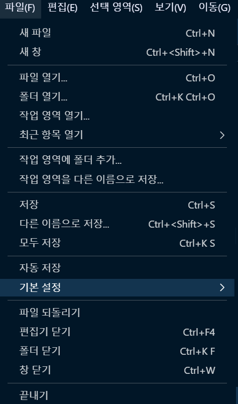
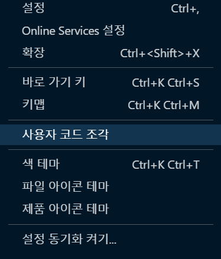
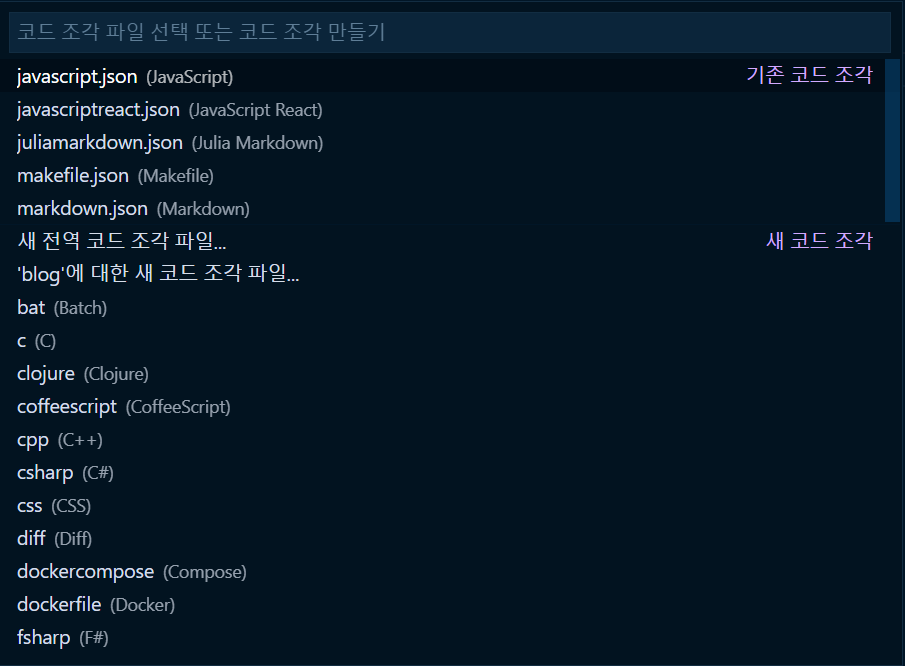
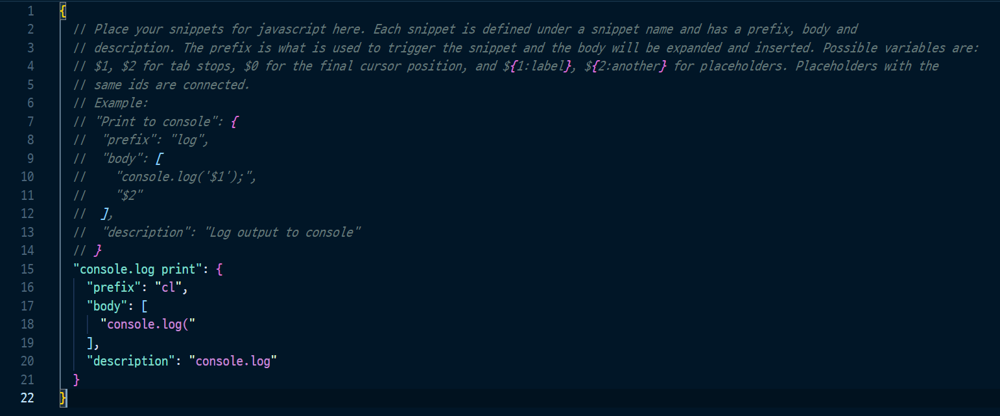

내가 프론트개발에서 제일 많이 사용하는 코드는 아마 `console.log()`일 것 이다.  
디버깅을 하기에 아주 좋은 코드라고 생각한다.
<br/>
<br/>
하지만 매번 `console.log()`를 처음부터 끝까지 작성하기란 손가락이 매우 아파온다.  
그래서 구글링을 통해 나와 같은 손가락 고통을 가진 사람들의 해결책을 찾아봤다.  
다행스럽게도 vscode에서 사용자 지정 단축키를 생성하는 방법을 찾을 수 있었다.
<br/>
<br/>
나의 소중한 손가락을 위해 Let's Go! 해보자.🐱‍🏍🐱‍🏍

### vscode 사용자 지정 단축키 생성
#### "파일/기본설정" 클릭!


#### "사용자 코드 조각" 클릭!


#### 언어 선택

👉 언어선택
1. 단축키 설정하고 싶은 언어를 선택 후 클릭!(주의❗ javascript.json에 단축키를 생성하면 다른 언어(C, markdown)에는 적용되지 않음)
1. 혹시 React를 사용한다면 javascriptreact.json이 따로 있으니 javascript.json에 설정하고 왜 안되냐고 하지말자구!

#### 단축키 설정

```json
"console.log print": {
		"prefix": "cl",
		"body": [
			"console.log("
		],
		"description": "console.log"
  }
```
👉 prefix
1. 사용자가 지정하는 단축키
1. 위 코드로 설정하면 `cl`이 단축키가 된다.

👉 body
1. 단축키의 원본 코드
1. 위 코드로 설정하면 `cl`작성하면 `console.log(`가 나타난다.
1. 처음에는 `console.log()`모두 설정했는데, 이렇게 되면 방향키로 다시 `()`안으로 커서를 움직여야 되서 `console.log(`까지만 설정 후 바로 코드를 작성할 수 있게 했다.

👉 description
1. 단축키 설명(딱히 필요없는?!)

👉 추가
```json
"console.log print": {
		"prefix": "fin",
		"body": [
			"👉"
		],
		"description": "finger"
  }
```
1. 이모티콘도 단축키로 설정 가능하다.
1. 혹시 `markdown`에 단축키를 설정하면 단축키를 작성하고 `ctrl + space`를 눌려야 단축키가 나타난다.

### 참고자료
1. [vscode 단축키 추가하기](https://soraji.github.io/js/2020/02/12/VSCconsolelog/) 